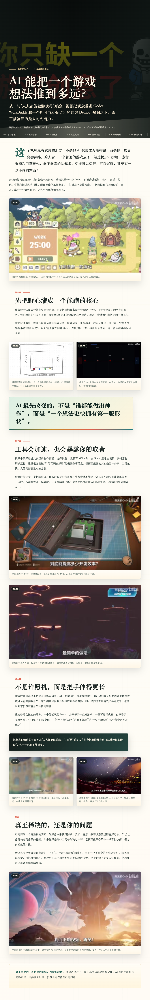

# Video Storyboard Slicer

把本地视频或可下载视频 URL 转成适合 AI 理解的素材包：自动下载、抽帧拼图、本地 Whisper 转录、B 站元数据读取、文案辅助重点区域截图，并生成可直接整理成公众号文章的 HTML 页面。

这个仓库既可以作为普通 Python 工具使用，也可以放进 `~/.codex/skills/` 作为 Codex skill 使用。

## 效果预览

下面两张是实际工作流生成并长截图保存的文章页示例。




## 能做什么

- 用 `yt-dlp` 下载视频 URL，支持 B 站常见链接。
- 读取 B 站标题、简介、封面、基础数据和前几条评论，辅助 AI 理解语境。
- 用本地 Whisper 生成带时间戳的转录文本。
- 按视频时长自适应抽帧。当前默认策略下，一小时视频 balanced 模式约 800 帧，长视频拼图每张最多 80 帧。
- 将截图按时间顺序排成 storyboard sheet，并强制先写 `visual_digest.md/json`，让第一路视觉分析真正参与理解。
- 根据视觉摘要和转录文案共同挑选可能有价值的时间段，再对这些区域做第二轮高密度拼图。
- 生成 `summary.html` 草稿，并提示 AI 改成公众号文章式排版。
- 用 `check_article_html.py` 拦截工程报告味的 HTML，避免把 dry summary 当成最终页面交付。
- 最后用 `package_summary.py` 清理工程文件，只留下 `summary.html`、`assets/` 和可选长图；打包时会再次检查文章质量。

## 环境要求

- Python 3.10+
- `ffmpeg` 和 `ffprobe`
- `yt-dlp`
- 本地 Whisper CLI，可选但推荐

安装 Python 依赖：

```bash
python3 -m pip install -r requirements.txt
```

macOS 上如果还没有 ffmpeg：

```bash
brew install ffmpeg
```

安装 Whisper CLI：

```bash
python3 -m pip install -U openai-whisper
```

## 作为 Codex Skill 使用

把仓库链接到 Codex skills 目录：

```bash
mkdir -p ~/.codex/skills
ln -s "$PWD" ~/.codex/skills/video-storyboard-slicer
```

之后在 Codex 里可以直接让它使用 `video-storyboard-slicer` 处理视频、总结视频、抽帧或生成公众号式 HTML。

## 快速开始

处理一个 B 站或其它可下载视频 URL：

```bash
python3 scripts/prepare_video_context.py "https://www.bilibili.com/video/BV..." --output ./video-context
```

处理本地视频：

```bash
python3 scripts/prepare_video_context.py ./input.mp4 --output ./video-context
```

只做画面抽帧，不跑 Whisper：

```bash
python3 scripts/prepare_video_context.py ./input.mp4 --output ./video-context --no-transcribe
```

只生成 storyboard：

```bash
python3 scripts/make_storyboard.py ./input.mp4 --output ./storyboard-out
```

预览自适应抽帧配置：

```bash
python3 scripts/make_storyboard.py ./input.mp4 --dry-run
```

## 三路视频理解

这个工作流不只靠转录，也不把截图当成备用素材。它分成三路：

1. 第一路看全片：先检查所有 `storyboard/sheets/storyboard_###.jpg`，写 `visual_digest.md` 或 `visual_digest.json`，总结画面类型、场景变化、视觉上值得截的时间点、重复段落和需要文案补充的地方。
2. 第二路听全片：用 Whisper、标题、简介和评论理解视频在说什么。
3. 第三路看重点：用视觉摘要和文案共同选择候选时间段，再跑 `extract_moment_frames.py` 做重点区域拼图。

第一轮处理结束后，先按 `visual_digest_prompt.md` 写视觉摘要：

```bash
# 打开并执行里面的要求，产出 visual_digest.md 或 visual_digest.json
cat ./video-context/visual_digest_prompt.md
```

没有 `visual_digest.md` 或 `visual_digest.json` 时，`package_summary.py --apply` 会拒绝最终打包。

## 文案辅助重点区域抽帧

完成第一路视觉摘要后，阅读 `summary_context.json`、`visual_digest.md/json`、`moment_selection_prompt.md` 和 Whisper 转录，写一个 `candidate_moments.json`：

```json
{
  "moments": [
    {
      "start": "00:01:20.00",
      "end": "00:01:35.00",
      "text": "这一段的转录线索",
      "reason": "这里可能有值得截图的画面变化",
      "priority": 1
    }
  ]
}
```

然后运行：

```bash
python3 scripts/extract_moment_frames.py ./video-context/summary_context.json ./video-context/candidate_moments.json
```

它会把每个候选时间段变成小型 storyboard，而不是只赌某一帧。

## 生成和清理最终 HTML

工作流会生成 `summary.html` 和 `ai_html_prompt.md`。先把 `summary.html` 改成面向读者的完整文章页，再执行清理。

先确认第一路视觉摘要已经存在：

```bash
ls ./video-context/visual_digest.md ./video-context/visual_digest.json
```

先检查它是不是还像工程总结：

```bash
python3 scripts/check_article_html.py ./video-context/summary.html
```

先 dry-run 查看会保留和删除哪些文件：

```bash
python3 scripts/package_summary.py ./video-context
```

确认后应用：

```bash
python3 scripts/package_summary.py ./video-context --apply
```

最终目录会只保留：

- `summary.html`
- `assets/`
- `summary-long.png`，如果你额外截了长图

## Whisper 配置

默认配置在 `config/defaults.json`。可以用环境变量覆盖：

```bash
export VIDEO_STORYBOARD_WHISPER_MODEL=small
export VIDEO_STORYBOARD_WHISPER_LANGUAGE=auto
export VIDEO_STORYBOARD_WHISPER_DEVICE=auto
```

如果当前视频明确是英文或中文，也可以在命令里指定：

```bash
python3 scripts/prepare_video_context.py ./input.mp4 --whisper-language en
python3 scripts/prepare_video_context.py ./input.mp4 --whisper-language zh
```

## 注意事项

- 只下载和分析你有权处理的视频内容。
- B 站视频有时需要 cookies，可用 `--cookies` 或 `--cookies-from-browser chrome`。
- `audio.wav` 本身不是给 AI 直接理解的输入；真正有用的是 Whisper 生成的转录文本。
- 如果画面细节不够清楚，调高 `--thumb-width` 或改用 `--density dense`。
- 如果只想快速扫长视频，默认 800 帧策略通常足够先判断内容结构。
- 不要跳过第一路视觉摘要；它决定后续候选片段和最终截图是否真的看过全片。
- 最终 HTML 不应该出现 `Source Screenshots`、`Storyboard Sheets`、`Transcript Excerpt`、`summary_context.json`、`manifest`、`frame_count` 等可见工程词；出现时先重写页面。
